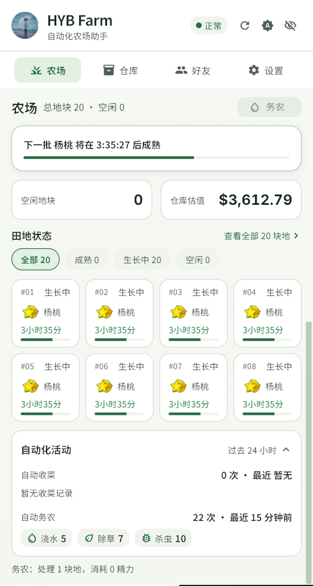
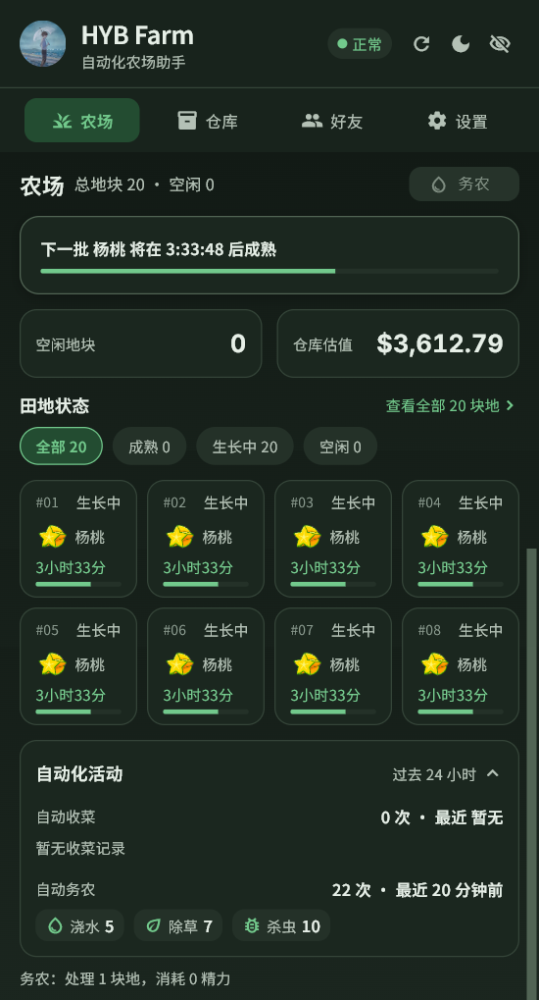

# HYB Farm Desktop

<div align="center">
  <strong>黑与白农场助手 · Windows 桌面端</strong><br>
  <sub>基于 Flutter 构建的后台托盘农场管理工具</sub>
</div>

<p align="center">
  <a href="https://github.com/ldm0715/hyb_farm_desktop/releases"></a>
  <a href="https://github.com/ldm0715/hyb_farm_desktop/actions/workflows/release-windows.yml"></a>
  <a href="https://github.com/ldm0715/hyb_farm_desktop/releases"></a>
  <a href="LICENSE"></a>
</p>

<br>

HYB Farm Desktop 是一个面向黑与白农场的 Windows 桌面客户端。它从 [HYB_farm_helper](https://github.com/ldm0715/HYB_farm_helper) 油猴脚本二次开发而来，将浏览器内的农场管理与自动化操作迁移为独立桌面应用。

应用通过内置登录页获取当前账号的登录状态，可在后台驻留系统托盘，集中提供农场、仓库、好友农场、自动化、日志和应用更新等能力。

> 本项目为非官方工具，与游戏或服务的官方运营方无隶属关系。

## 功能

| 模块 | 功能 |
| --- | --- |
| 作物收益排行 | 根据实时回收价格、成熟周期和产量计算作物的单次收益与单位时间收益；显示昨日价格涨跌趋势。 |
| 我的农场 | 查看地块、作物成熟状态、空地和待处理的缺水 / 杂草 / 虫害异常；提供每日偷菜 / 帮助汇总日报。 |
| 收菜与补种 | 支持一键收获；可在自动收菜后执行自动补种。 |
| 自动务农 | 定时检查农场状态并处理可务农的异常地块；系统休眠唤醒后会自动恢复并补收已成熟作物。 |
| 我的仓库 | 查看库存、回收价格及收益排行；支持手动种植和回收卖出。 |
| 好友农场 | 查看好友农场状态，访问好友农场并执行偷菜操作；记录本机最近 24 小时的成功偷菜历史。 |
| 账户与安全 | 内置 WebView 登录；登录 Cookie 保存于本机安全存储，并在 HTTP 请求与 WebView 间同步；明确提示网络异常、登录失效与人机验证状态。 |
| 人机验证恢复 | 触发 Cloudflare 人机验证时切换托盘状态并发送 Windows 通知；完成验证后自动恢复被拦截的收菜 / 务农任务。 |
| 应用更新 | 可检查 GitHub Releases、查看 Markdown 更新说明，并在应用内下载和启动新版安装器。更新下载支持官方源或第三方镜像，并对安装包执行 SHA256 校验。 |
| 日志与诊断 | 支持按日期滚动记录、敏感信息脱敏、自定义日志目录、查看当日日志和打开日志文件夹。 |
| 托盘与桌面体验 | 关闭窗口后继续在系统托盘运行；支持浅色 / 暗色主题、记住窗口位置、鼠标移出后自动隐藏到托盘，以及自动化期间保持电脑运行。 |
| 账户展示 | 支持 VIP 金色头像光环与账户总余额展示。 |

## 安装方式

推荐从 [GitHub Releases](https://github.com/ldm0715/hyb_farm_desktop/releases) 下载最新发布包；无需安装 Flutter 或其他开发环境。

在最新版本的 **Assets** 中按需下载：

- `HYB-Farm-Desktop-<版本号>-Setup.exe`：安装版，下载后直接运行安装程序。
- `HYB-Farm-Desktop-<版本号>-windows-x64-portable.zip`：便携版，解压后运行其中的 `hyb_farm_desktop.exe`。
- `HYB-Farm-Desktop-<版本号>-SHA256.txt`：上述两个发布包的 SHA256 校验值。

首次启动后，请在内置登录页完成黑与白农场账号登录。

### 校验下载文件

如需验证下载文件完整性，可在 PowerShell 中执行：

```powershell
Get-FileHash .\HYB-Farm-Desktop-<版本号>-Setup.exe -Algorithm SHA256
```

将输出的哈希值与同版本 `HYB-Farm-Desktop-<版本号>-SHA256.txt` 中对应文件的值比较即可。便携版同理。

### 应用内更新

已安装版本可在 **设置 → 关于与数据 → 检查更新** 中检查并安装新版本。下载时可选择官方源、自动选择或已启用的第三方镜像；第三方镜像仅用于加速，应用会在安装前校验安装包 SHA256。

> 第三方镜像由第三方提供，项目不保证其安全性、下载速度与长期可用性。无法完成安全校验时，请改用官方源。

## 界面展示

亮色主题：



暗色主题：



> 截图用于展示基础界面风格；具体页面会随版本迭代更新。

## 技术栈

| 部分 | 技术 |
| --- | --- |
| 应用框架 | Flutter / Dart |
| 目标平台 | Flutter Windows（x64） |
| 状态管理 | Provider |
| 网络请求 | Dio |
| 登录与 Cookie | `flutter_inappwebview`、`flutter_secure_storage` |
| 窗口与托盘 | `window_manager`、`system_tray`、`screen_retriever` |
| 本地设置、文件与日志 | `shared_preferences`、`path_provider`、`file_selector` |
| 更新与完整性校验 | `flutter_markdown`、`crypto` |
| 通知 | `flutter_local_notifications` |

## 环境要求

- Windows 10 / 11（x64）
- Flutter SDK：`3.38.7`（CI 构建固定版本）
- Dart SDK：`^3.10.7`（见 `pubspec.yaml`）
- 已配置 Flutter Windows desktop 开发环境

可通过以下命令确认 Windows 桌面端已启用：

```bash
flutter config --enable-windows-desktop
flutter devices
```

## 本地运行

```bash
# 获取依赖
flutter pub get

# 调试运行
flutter run -d windows
```

首次启动后，请在内置登录页完成黑与白农场账号登录。登录成功后，应用会加载农场、仓库和好友农场数据。

## 常用命令

```bash
# 静态检查
flutter analyze

# 运行全部测试
flutter test

# 运行单个测试文件
flutter test test/farm_state_test.dart

# 构建 Windows Release
flutter build windows --release
```

Release 产物默认位于：

```text
build/windows/x64/runner/Release/
```

> 构建前必须关闭正在运行的 `hyb_farm_desktop.exe`。否则 `WebView2Loader.dll` 可能被占用，导致 Windows 构建报错。

## 使用说明

1. 启动应用，在内置登录页完成账号登录。
2. 在**农场**页面查看地块状态、每日汇总，手动收菜或处理异常。
3. 在**仓库**页面查看库存、收益排行与昨日价格趋势，进行种植或回收卖出。
4. 在**好友**页面查看好友农场状态、最近偷菜记录，并按需偷菜。
5. 在**设置**页面调整主题、自动收菜、自动补种、自动务农、自动化期间保持电脑运行、日志目录和窗口行为。
6. 在**设置 → 关于与数据**中检查更新；需要时选择下载源并下载安装新版。
7. 若出现「需验证」状态，请从账户相关入口打开内置验证页完成验证；完成后应用会自动恢复可重试的自动化任务。
8. 关闭窗口后，应用会驻留系统托盘；从托盘菜单可重新打开窗口或调整自动化开关。

## 项目结构

```text
lib/
├── api/          # 农场接口封装与数据模型
├── auth/         # 登录、Cookie 持久化、WebView Cookie 同步
├── core/         # 常量、格式化、连接状态、请求分类、操作协调
├── services/     # 自动化、更新、日志、通知、电源恢复与本地数据服务
├── state/        # 农场、好友、设置和连接状态
├── theme/        # 亮/暗主题与设计令牌
├── tray/         # Windows 系统托盘
└── ui/           # 登录、农场、仓库、好友、设置及通用组件

test/             # 单元测试、Widget 测试与接口夹具
windows/          # Flutter Windows 平台工程
assets/           # 应用图标与本地字体
installer/        # Inno Setup 安装包脚本
```

## 接口与登录状态

应用依赖黑与白农场的相关接口，并使用登录账号当前的 Cookie 进行认证。

- 登录失效、网络异常、请求限流或人机验证可能导致数据加载和自动化操作不可用。
- 遇到人机验证时，请在内置验证页按页面提示完成验证；成功后应用会恢复可重试的自动化任务。
- 自动收菜、补种、务农、回收和偷菜都会直接作用于账号数据；启用前请确认账号和配置无误。
- 应用日志会脱敏 Cookie、Token 和 URL 查询参数；仍建议不要将日志文件公开分享给不可信对象。

## 上游项目

本项目的功能与接口逻辑参考油猴脚本项目：

- [ldm0715/HYB_farm_helper](https://github.com/ldm0715/HYB_farm_helper)

上游项目运行于浏览器 Tampermonkey 环境；本仓库为 Flutter Windows 桌面端实现。两者功能目标相近，但应用形态、交互方式和代码结构不同。

## 开发约定

```bash
# 修改后至少执行
flutter analyze
flutter test
```

涉及 Windows Release 构建时，请先确认应用进程已经退出。
